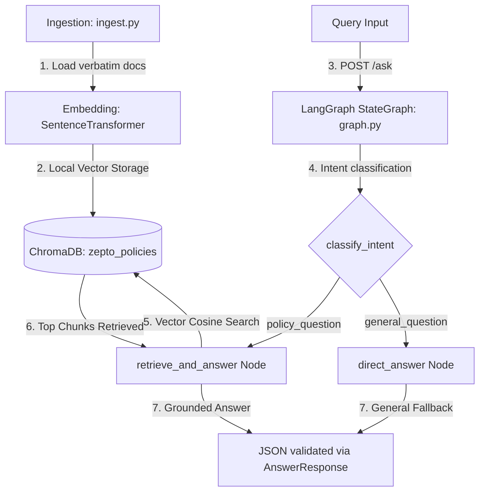

# Zepto Customer Support Assistant - Core RAG Pipeline & API

This module implements the core RAG (Retrieval-Augmented Generation) pipeline and a FastAPI server for **Zepto Customer Support**. It handles queries related to delivery, returns, refunds, membership, tracking, cancellation, gift cards, and support hours using local embeddings and a persistent vector database.

---

## System Architecture & Data Flow

The RAG pipeline flows in 4 distinct stages:



1. **Ingestion (`ingest.py`'s `ingest_policies()`)**:
   Loads the 8 policy text files (`doc_01.txt` through `doc_08.txt`) from the `docs/` folder. Since they are short, each document is treated as a single chunk.
2. **Embedding (`sentence-transformers`' `all-MiniLM-L6-v2`)**:
   Each chunk is encoded locally into a 384-dimensional vector embedding. This process runs fully offline and does not require an API key.
3. **Retrieval (`graph.py`'s `retrieve_and_answer` node)**:
   When a user query is classified as a `policy_question`, the node embeds the query using `all-MiniLM-L6-v2` and queries the `"zepto_policies"` ChromaDB collection to retrieve the top-3 most similar policy documents using cosine similarity.
4. **Generation (`graph.py`'s `retrieve_and_answer` / `direct_answer` node)**:
   In default mock mode, the `retrieve_and_answer` node formats the top retrieved context chunk. If the query is a general question, the `direct_answer` node generates a standard policy restriction message. The final output is validated against the `AnswerResponse` Pydantic model (`schema.py`).

---

## MOCK_LLM Branching Logic

The pipeline behavior branches depending on the environment variable `MOCK_LLM` (default `1` = mock mode, `0` = real LLM extension):

- **Intent Classification Node (`classify_intent`)**:
  - *MOCK_LLM = 1 (Default)*: Determinisitically checks if the query contains any policy keywords.
  - *MOCK_LLM = 0*: Stubs are provided to trigger an external LLM classification call.
- **Retrieval and Answering Node (`retrieve_and_answer`)**:
  - *MOCK_LLM = 1 (Default)*: Bypasses external calls, returning the first 200 characters of the top matching Chroma document as a mock answer, setting `confidence` to `1.0`.
  - *MOCK_LLM = 0*: Formats the structured prompt from `prompts.py` using retrieved context blocks and submits it to a local LLM or API endpoint (e.g. Groq).
- **Direct Answer Node (`direct_answer`)**:
  - *MOCK_LLM = 1 (Default)*: Returns a static mock string: `"I can only answer questions about Zepto policies right now."`
  - *MOCK_LLM = 0*: Returns an LLM-generated general chat fallback.

---

## API Examples (MOCK_LLM=1)

Below are the raw JSON transcripts returned by the FastAPI server on port 7860:

### 1. Retrieval Triggered (Policy Query)

- **Request**:
  ```http
  POST http://127.0.0.1:7860/ask
  Content-Type: application/json

  {
    "query": "How can I return damaged groceries?"
  }
  ```
- **Response**:
  ```json
  {
    "answer": "Based on the retrieved context: Grocery and perishable items may be reported for a return within 24 hours of delivery if damaged, spoiled, or incorrect; non-perishable packaged items may be returned within 7 days of delivery in unop",
    "sources": [
      "doc_02.txt"
    ],
    "confidence": 1.0
  }
  ```

### 2. Retrieval NOT Triggered (General Query)

- **Request**:
  ```http
  POST http://127.0.0.1:7860/ask
  Content-Type: application/json

  {
    "query": "What is the capital of Japan?"
  }
  ```
- **Response**:
  ```json
  {
    "answer": "I can only answer questions about Zepto policies right now.",
    "sources": [],
    "confidence": 1.0
  }
  ```

---

## How to Build & Run with Docker

To containerize the application and run it locally, execute the following commands in the directory containing the `Dockerfile`:

### 1. Build the Docker Image
```bash
docker build -t support-assistant .
```

### 2. Run the Docker Container
```bash
docker run -p 7860:7860 support-assistant
```

This starts the Uvicorn server inside the container, mapping port `7860` to your host machine. You can query the containerized API at `http://localhost:7860/ask`.

---

## Optional Extensions Note

The `MOCK_LLM=0` / Groq API integration and Hugging Face Spaces deployment are optional and were not required for baseline grading. This implementation focuses on delivering a fully functional, local, offline-capable RAG pipeline that runs without external keys or network requests.
